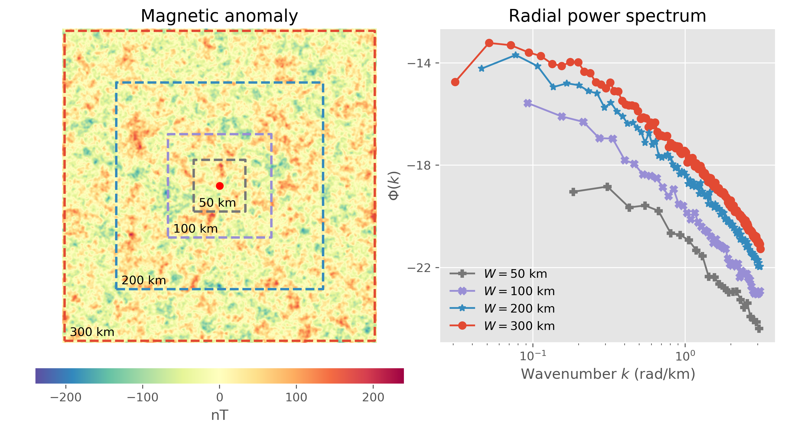

**Figure 1.** Samples meshes on the sphere produced by `pycurious` based on the octahedron with added points at the face centroids (far left), and the icosahedron with with face points (left). An icosahedron grid with refinement in regions where ocean age-grid information is available [@MullerEtAl2008], and an icosahedral mesh refined to create a smooth heat-map of seismic activity and average earthquake depth from a global catalogue of earthquakes of magnitude > 5.5 since 1990 from the IRIS online catalogue

# Summary

Magnetic data is one of the most prevelant geophysical datasets available on the surface of the Earth. Curie depth is the depth at which rocks lose their magnetism. The most prevalent magnetic mineral is magnetite, which has a Curie point of 580°C, thus the Curie depth is often interpreted as the 580°C isotherm. Current methods to derive Curie depth first compute the (fast) Fourier transform over a square window of a magnetic anomaly that has been reduced to the pole. The depth and thickness of magnetic sources is estimated from the slope of the radial power spectrum.

Our package, `pycurious`, is a Python-based  implements the Tanaka et al. (1999) and Bouligand et al. (2009) methods for computing the thickness of a buried magnetic source. The former selects portions of the radial power spectrum in the low and high frequency domain to compute the depth of magneic sources, while the latter fits an analytical solution to the entire power spectrum. We cast the Bouligand et al. (2009) method within a Bayesian framwork to estimate the uncertainty of Curie depth calculations.

`pycurious` is an object-oriented package that accepts grids of the Earth's magnetic anomaly and computes the Curie depth using a specified window size. The computation is distributed across all available processors to improve efficiency over large study areas. A mapping module includes a set of fucntions that help to wrangle maps of the magnetic anomaly into a useable form for `pycurious`.

`pycurious` includes the following functionality:

- Importing and exporting GeoTiffs
- Converting between geospatial coordinate reference systems
- Selection of window sizes over which to compute Curie depth
- Parallel computation of curie depth across computing resources
- Bayesian inversion framework and sensitivity analysis

## Documentation

`pycurious` is bundled with a linked collection of jupyter notebooks that can act as a user guide and an introduction to the package. The notebooks are split into matching sets for frequentist and Bayesian estimates of Curie depth. The notebooks cover:

- Plotting the radial and azimuthal power spectrum
- Computing Curie depth from a synthetic magnetic anomaly
- Exploring parameter sensitivity
- Posing the inverse problem and objective function
- Mapping Curie depth using the EMAG2 magnetic anomaly dataset

All documentation can be accessed from within the module via a python function that installs the notebooks at a filesystem location specified by the user at run time.

## Installation, Dependencies and Usage

`pycurious` requires `numpy` and `Cython` to compile C routines that are included with the distribution. The documentation is supplied in the form of jupyter notebooks (the jupyter environment is a dependency) which also have optional dependencies for the `cartopy` mapping package. `pycurious` and all python dependencies can be installed through the pypi.org `pip` package. However, several of the dependencies for `cartopy` may cause problems for inexperienced users. We therefore provided a fully build docker image and a deployment of the documentation / examples on [mybinder.org](https://mybinder.org/v2/gh/brmather/pycurious/binder?filepath=Notebooks%2F0-StartHere.ipynb)

# Acknowledgements

Development of `pycurious` was inspired from [`pycpd`](https://github.com/groupeLIAMG/pycpd) and [`fatiando a terra`](https://github.com/fatiando/fatiando).

# References
